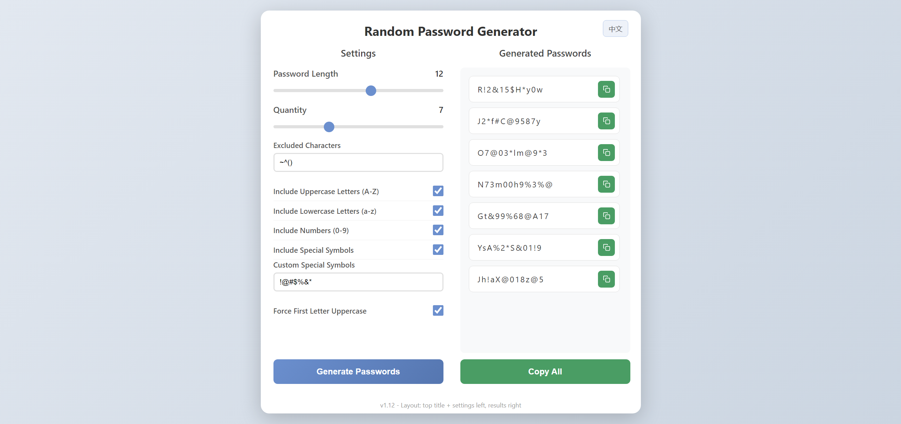

# Offline Random Password Generator

**Single File · Fully Offline · Cryptographically Secure**

**English** · [简体中文](./README.md)

 

  
  
  
  

 

[Get Started](#-get-started) ·
[Features](#-features) ·
[Preview](#preview) ·
[Changelog](#changelog) ·
[Live Preview](https://random-password.springshaw.top/)

---

## Overview

> **Your passwords never leave the browser.** This tool generates cryptographically secure passwords locally with `crypto.getRandomValues` — zero servers, zero uploads, zero dependencies. Just open the HTML file and go. Custom length, character types, exclusion rules, weak-password blocking, batch generation, one-click copy, and bilingual UI are all built in. Settings auto-save so everything is ready on your next visit.

## Preview

## Features

### 🔐 Password Generation Core
- Custom password length (1–20 characters)
- Generate 1–20 passwords at once
- Uses `crypto.getRandomValues` for cryptographically secure randomness with rejection sampling to avoid modulo bias

### 🎛️ Password Rules
- **Character type selection**: uppercase letters, lowercase letters, digits, and special symbols
- **Force first letter uppercase**: the first character excludes the ambiguous letter `I` to avoid confusion with digit `1` and lowercase `i`
- **Custom excluded characters**: specify any characters you don't want — defaults to `~^()`
- **Custom special symbols**: specify exactly which symbols to use — defaults to `!@#$%&*`
- **Weak-password keyword blocking**: over 30 common weak-password words are blocked by default, including `admin`, `pass`, `root`, `123456`, etc.

### 🧠 Smart Rules
- Each selected character type accounts for **at least 25%** of the final password, ensuring complexity
- **No consecutive special symbols** to improve security
- Characters are shuffled after generation for an even random distribution

### 🖱️ Copy & Interaction
- Per-password copy button with grey confirmation feedback
- Copy-all button for batch copy, passwords separated by newlines
- Two-column layout with independently scrollable password list

### 🌐 Bilingual UI
- Automatically displays Chinese or English based on browser language
- Chinese browsers default to Chinese; non-Chinese browser languages default to English
- Manual language switching is persisted via `localStorage`

### 💾 Settings Persistence
- All settings are auto-saved after each password generation
- Settings are restored automatically when you reopen the page
- Built-in 5MB localStorage quota protection

### 🔖 Tab Icon
- Inline lock-shaped SVG favicon that matches the page's gradient theme
- Makes the browser tab easy to identify

## 🚀 Get Started

### Option 1: Open Locally (Recommended)

Open [`password-generator.html`](./password-generator.html) directly in your browser. No deployment or server required — everything runs offline.

### Option 2: Deploy on Vercel

The repo includes [`vercel.json`](./vercel.json). Fork the project, import it into Vercel, and deploy with one click. The root path `/` routes to the password generator.

## Changelog

See [VERSIONS.md](./VERSIONS.md) for detailed version history.

## Highlights

- ✨ Single file, no dependencies, fully offline
- 🎨 Clean, modern gradient UI
- 🔒 Privacy-first: passwords are generated locally and never uploaded
- 🛡️ Smart rules ensure password complexity
- 💾 Settings auto-saved, ready to use on next visit
- 🌐 Bilingual Chinese/English with automatic browser language detection

---

## 📬 Contact Me

- 🌐 **Website:** [springshaw.top](https://springshaw.top/)
- ✉️ **Email:** [springshaw2046@outlook.com](mailto:springshaw2046@outlook.com)

 

[↑ Back to top](#offline-random-password-generator)

