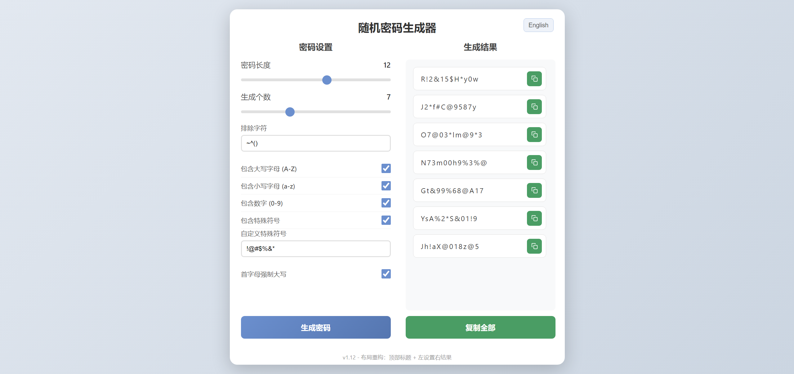

# 离线随机密码生成器

**单文件 · 完全离线 · 密码学安全随机数**

[English](./README.en.md) · **简体中文**

 

  
  
  
  

 

[快速开始](#-快速开始) ·
[功能特性](#-功能特性) ·
[界面预览](#界面预览) ·
[版本历史](#版本历史) ·
[在线预览](https://random-password.springshaw.top/)

---

## 概览

> **密码不应离开你的浏览器。** 本工具在本地用 `crypto.getRandomValues` 生成密码学安全随机密码，零服务器、零上传、零依赖——打开 HTML 文件即可用。集成自定义长度、字符类型、排除规则、弱密码屏蔽、批量生成、一键复制与中英文切换，所有配置自动保存，下次打开即用。

## 界面预览

## 功能特性

### 🔐 密码生成核心
- 自定义密码长度 (1-20位)
- 支持同时生成 1-20 个密码
- 使用 `crypto.getRandomValues` 生成密码学安全随机数，拒绝采样避免取模偏差

### 🎛️ 密码规则选项
- **字符类型选择**：大写字母、小写字母、数字、特殊符号
- **强制首字母大写**：首字母排除易混淆字符 `I`，避免和数字 `1`、小写 `i` 混淆
- **自定义排除字符**：可指定不想要的任意字符，默认排除 `~^()`
- **自定义特殊符号**：可指定只使用哪些特殊符号，默认 `!@#$%&*`
- **排除弱密码关键词**：默认屏蔽 30+ 常见弱密码词如 `admin`、`pass`、`root`、`123456` 等

### 🧠 智能规则
- 每种选中字符类型**至少占 25%**，保证密码复杂度
- **特殊符号不允许连续出现**，提高安全性
- 生成后打乱字符顺序，确保随机分布

### 🖱️ 复制与交互
- 每个密码独立复制按钮，已复制后按钮变灰反馈
- 一键全部复制，多个密码以换行分隔
- 分栏布局，左侧密码列表支持独立滚动

### 🌐 中英文切换
- 根据浏览器语言自动显示中文或英文界面
- 中文浏览器默认中文，其他语言浏览器默认英文
- 手动切换语言后自动记住（`localStorage` 持久化）

### 💾 配置持久化
- 每次生成密码后自动保存所有设置
- 浏览器关闭后重新打开，自动恢复上次配置
- 内置 5MB localStorage 存储上限保护

### 🔖 页签图标
- 内置锁形 SVG favicon，与页面渐变风格一致
- 浏览器标签页更易识别

## 🚀 快速开始

### 方式一：本地打开（推荐）

直接用浏览器打开 [`password-generator.html`](./password-generator.html) 即可使用，无需部署，无需服务器，完全离线运行。

### 方式二：Vercel 在线部署

项目自带 [`vercel.json`](./vercel.json)，Fork 后导入 Vercel 即可一键部署；根路径 `/` 自动指向密码生成器页面。

## 版本历史

查看 [VERSIONS.md](./VERSIONS.md) 了解详细更新记录。

## 特点

- ✨ 单文件，无需依赖，完全离线
- 🎨 简洁美观的渐变背景界面
- 🔒 隐私安全，密码本地生成不上传服务器
- 🛡️ 智能规则保证密码复杂度
- 💾 自动保存配置，打开即用
- 🌐 中英文双语支持，自动识别浏览器语言

---

## 📬 联系我

- 🌐 **主页：** [springshaw.top](https://springshaw.top/)
- ✉️ **邮箱：** [springshaw2046@outlook.com](mailto:springshaw2046@outlook.com)

 

[↑ 回到顶部](#离线随机密码生成器)

